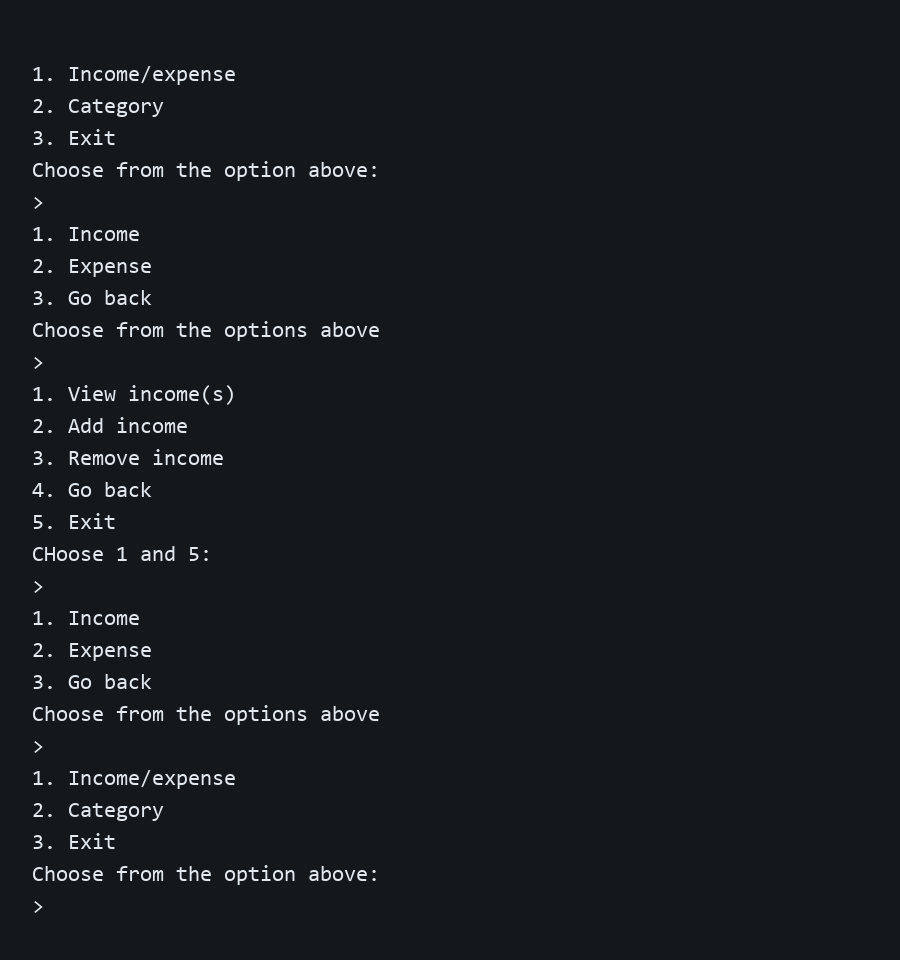

# Expense Tracker

A simple command-line expense tracker built with Python, SQLite, and Rich. The application lets you organize income and expenses with categories and stores the data locally in a SQLite database.

## Features

- Add, view, and remove income transactions
- Add, view, and remove expense transactions
- Create and remove income or expense categories
- Store transaction titles, amounts, descriptions, types, categories, and timestamps
- Persist data locally with SQLite
- Use formatted terminal output with Rich

## Requirements

- Python 3.10 or newer
- The `rich` Python package

## Installation

Clone the repository and install the dependency:

```bash
git clone https://github.com/your-username/Expense_Tracker.git
cd ..
python -m pip install rich
```

> The application currently uses the relative database path `./Expense_Tracker/transaction.db`. Run the program from the directory that contains the `Expense_Tracker` project folder.

## Run the application

From the directory containing the cloned project:

```bash
python Expense_Tracker/expense_tracker.py
```

The program creates the SQLite tables automatically when it starts. Use the numbered menus to:

1. Manage income and expenses
2. View, add, or remove categories
3. Exit the application

The database is stored in `Expense_Tracker/transaction.db`.

## Preview



## Data model

The application creates two tables:

- `Categories`: stores category names and whether they apply to income or expenses
- `Transactions`: stores transaction details and links each transaction to a category

## Project structure

```text
Expense_Tracker/
├── expense_tracker.py
├── transaction.db
└── README.md
```

## Notes

- Category names and transaction titles are normalized to lowercase.
- Amounts must be greater than zero.
- A category should be created before adding a transaction that uses it.
- This project is a local command-line application; it does not include a web interface or cloud synchronization.

## License

No license has been specified for this project yet.